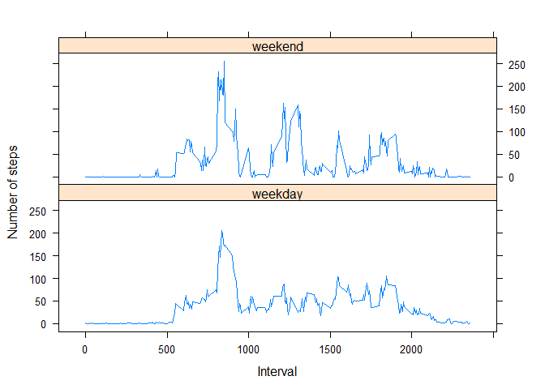

# Reproducible Research: Peer Assessment 1


## Loading and preprocessing the data

This is the first Peer Assessment project for the Reproducible Research course.

First, the appropriate libraries must be loaded to allow for the calcualations that will be completed.


```r
require("dplyr")
```

```
## Loading required package: dplyr
## 
## Attaching package: 'dplyr'
## 
## The following objects are masked from 'package:stats':
## 
##     filter, lag
## 
## The following objects are masked from 'package:base':
## 
##     intersect, setdiff, setequal, union
```

```r
require("ggplot2")
```

```
## Loading required package: ggplot2
```

```r
require("scales")
```

```
## Loading required package: scales
```

##Load and preprocess the data
#### Open activity file and store in table


```r
activ <- read.csv(".//activity.csv")
glimpse(activ)
```

```
## Observations: 17568
## Variables:
## $ steps    (int) NA, NA, NA, NA, NA, NA, NA, NA, NA, NA, NA, NA, NA, N...
## $ date     (fctr) 10/1/2012, 10/1/2012, 10/1/2012, 10/1/2012, 10/1/201...
## $ interval (int) 0, 5, 10, 15, 20, 25, 30, 35, 40, 45, 50, 55, 100, 10...
```


## What is mean total number of steps taken per day?
#### Determine total steps per day calculation


```r
aggSum <- activ %>% group_by(date) %>% summarize(totSteps = sum(steps, na.rm = FALSE))
glimpse(aggSum)
```

```
## Observations: 61
## Variables:
## $ date     (fctr) 10/1/2012, 10/10/2012, 10/11/2012, 10/12/2012, 10/13...
## $ totSteps (int) NA, 9900, 10304, 17382, 12426, 15098, 10139, 15084, 1...
```


#### Create histogram of total steps per day

```
## stat_bin: binwidth defaulted to range/30. Use 'binwidth = x' to adjust this.
```

 

#### Calculate and report the mean and median number of steps per day


```r
meanSteps <- mean(aggSum$totSteps, na.rm = TRUE)
medianSteps <- median(aggSum$totSteps, na.rm = TRUE)
```
The average number of steps per day is 10766.19.  
The median number of steps per day is 10765.  


## What is the average daily activity pattern?
#### Plot time series graph of the 5-minute intervals and the average number of steps taken


```r
intAvg <- activ %>% group_by(interval) %>% summarize(meanSteps = mean(steps, na.rm = TRUE))

ggplot(intAvg, aes(interval, meanSteps)) + geom_line() +
    xlab("5-Second Time Interval") + 
    ylab("Average Steps Taken") + 
    ggtitle("Time Series - Steps Taken")
```

 

```r
paste("The Max number of steps in an interval was", filter(intAvg, meanSteps==max(meanSteps)))
```

```
## [1] "The Max number of steps in an interval was 835"             
## [2] "The Max number of steps in an interval was 206.169811320755"
```


## Imputing missing values
#### Calculate the total number of rows where there is an NA in the row


```r
enAyRows <- sum(is.na(activ))
paste("There are", enAyRows, "rows with NA.")
```

```
## [1] "There are 2304 rows with NA."
```


#### Create a new dataset that is equal to the original dataset but with the missing data filled in.


```r
activImp <- inner_join(activ, intAvg, by="interval") %>% 
    mutate(steps=ifelse(is.na(steps),meanSteps,steps)) %>%
    select(date,interval,steps)
glimpse(activImp)
```

```
## Observations: 17568
## Variables:
## $ date     (fctr) 10/1/2012, 10/1/2012, 10/1/2012, 10/1/2012, 10/1/201...
## $ interval (int) 0, 5, 10, 15, 20, 25, 30, 35, 40, 45, 50, 55, 100, 10...
## $ steps    (dbl) 1.7169811, 0.3396226, 0.1320755, 0.1509434, 0.0754717...
```


#### Make a histogram of the total number of steps taken each day and Calculate and report the mean and median total number of steps taken per day. Do these values differ from the estimates from the first part of the assignment? What is the impact of imputing missing data on the estimates of the total daily number of steps?

Are there differences in activity patterns between weekdays and weekends?


```r
aggSumImp <- activImp %>% group_by(date) %>% summarize(totStepsImp = sum(steps, na.rm = FALSE))

ggplot(data=aggSumImp, aes(totStepsImp)) + geom_histogram()
```

```
## stat_bin: binwidth defaulted to range/30. Use 'binwidth = x' to adjust this.
```

 

```r
meanStepsImp <- mean(aggSumImp$totStepsImp, na.rm = TRUE)
medianStepsImp <- median(aggSumImp$totStepsImp, na.rm = TRUE)
```


## Are there differences in activity patterns between weekdays and weekends?
The average and median differ little from the non-imputed metrics since the average value was imputed.

One might expect that there would be little difference - the analysis supports that expectation.


#### Create a new factor variable in the dataset with two levels – “weekday” and “weekend” indicating whether a given date is a weekday or weekend day.


```r
activImp <- activImp %>%
    mutate(weekend.indicator =
               as.factor(ifelse(weekdays(as.Date(date)) %in% c("Saturday","Sunday"),
                                "weekend","weekday")))

intAvgImpWk <- activImp %>% group_by(interval) %>% summarize(meanStepsWeekend = mean(steps, na.rm = TRUE))

wk_df <- aggregate(steps ~ weekend.indicator+interval, data=activImp, FUN=mean)
```


#### Make a panel plot containing a time series plot (i.e. type = "l") of the 5-minute interval (x-axis) and the average number of steps taken, averaged across all weekday days or weekend days (y-axis).  


```r
library(lattice)
xyplot(steps ~ interval | factor(weekend.indicator),
       layout = c(1, 2),
       xlab="Interval",
       ylab="Number of steps",
       type="l",
       lty=1,
       data=wk_df)
```

 
